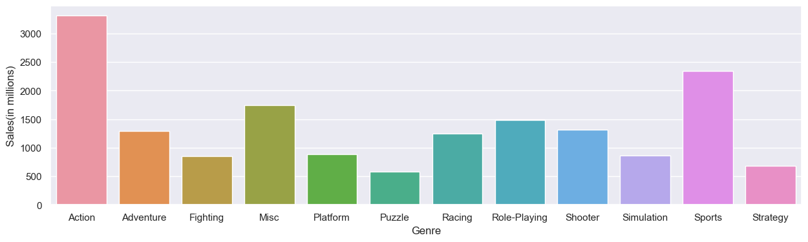

## Добавляем необходимые библиотеки


```python
import pandas as pd
import seaborn as sns
```

## Чтение датасета


```python
videogames = pd.read_csv("./vgsales.csv")
videogames
```


<div>
<style scoped>
    .dataframe tbody tr th:only-of-type {
        vertical-align: middle;
    }

    .dataframe tbody tr th {
        vertical-align: top;
    }

    .dataframe thead th {
        text-align: right;
    }
</style>
<table border="1" class="dataframe">
  <thead>
    <tr style="text-align: right;">
      <th></th>
      <th>Rank</th>
      <th>Name</th>
      <th>Platform</th>
      <th>Year</th>
      <th>Genre</th>
      <th>Publisher</th>
      <th>NA_Sales</th>
      <th>EU_Sales</th>
      <th>JP_Sales</th>
      <th>Other_Sales</th>
      <th>Global_Sales</th>
    </tr>
  </thead>
  <tbody>
    <tr>
      <th>0</th>
      <td>1</td>
      <td>Wii Sports</td>
      <td>Wii</td>
      <td>2006.0</td>
      <td>Sports</td>
      <td>Nintendo</td>
      <td>41.49</td>
      <td>29.02</td>
      <td>3.77</td>
      <td>8.46</td>
      <td>82.74</td>
    </tr>
    <tr>
      <th>1</th>
      <td>2</td>
      <td>Super Mario Bros.</td>
      <td>NES</td>
      <td>1985.0</td>
      <td>Platform</td>
      <td>Nintendo</td>
      <td>29.08</td>
      <td>3.58</td>
      <td>6.81</td>
      <td>0.77</td>
      <td>40.24</td>
    </tr>
    <tr>
      <th>2</th>
      <td>3</td>
      <td>Mario Kart Wii</td>
      <td>Wii</td>
      <td>2008.0</td>
      <td>Racing</td>
      <td>Nintendo</td>
      <td>15.85</td>
      <td>12.88</td>
      <td>3.79</td>
      <td>3.31</td>
      <td>35.82</td>
    </tr>
    <tr>
      <th>3</th>
      <td>4</td>
      <td>Wii Sports Resort</td>
      <td>Wii</td>
      <td>2009.0</td>
      <td>Sports</td>
      <td>Nintendo</td>
      <td>15.75</td>
      <td>11.01</td>
      <td>3.28</td>
      <td>2.96</td>
      <td>33.00</td>
    </tr>
    <tr>
      <th>4</th>
      <td>5</td>
      <td>Pokemon Red/Pokemon Blue</td>
      <td>GB</td>
      <td>1996.0</td>
      <td>Role-Playing</td>
      <td>Nintendo</td>
      <td>11.27</td>
      <td>8.89</td>
      <td>10.22</td>
      <td>1.00</td>
      <td>31.37</td>
    </tr>
    <tr>
      <th>...</th>
      <td>...</td>
      <td>...</td>
      <td>...</td>
      <td>...</td>
      <td>...</td>
      <td>...</td>
      <td>...</td>
      <td>...</td>
      <td>...</td>
      <td>...</td>
      <td>...</td>
    </tr>
    <tr>
      <th>16593</th>
      <td>16596</td>
      <td>Woody Woodpecker in Crazy Castle 5</td>
      <td>GBA</td>
      <td>2002.0</td>
      <td>Platform</td>
      <td>Kemco</td>
      <td>0.01</td>
      <td>0.00</td>
      <td>0.00</td>
      <td>0.00</td>
      <td>0.01</td>
    </tr>
    <tr>
      <th>16594</th>
      <td>16597</td>
      <td>Men in Black II: Alien Escape</td>
      <td>GC</td>
      <td>2003.0</td>
      <td>Shooter</td>
      <td>Infogrames</td>
      <td>0.01</td>
      <td>0.00</td>
      <td>0.00</td>
      <td>0.00</td>
      <td>0.01</td>
    </tr>
    <tr>
      <th>16595</th>
      <td>16598</td>
      <td>SCORE International Baja 1000: The Official Game</td>
      <td>PS2</td>
      <td>2008.0</td>
      <td>Racing</td>
      <td>Activision</td>
      <td>0.00</td>
      <td>0.00</td>
      <td>0.00</td>
      <td>0.00</td>
      <td>0.01</td>
    </tr>
    <tr>
      <th>16596</th>
      <td>16599</td>
      <td>Know How 2</td>
      <td>DS</td>
      <td>2010.0</td>
      <td>Puzzle</td>
      <td>7G//AMES</td>
      <td>0.00</td>
      <td>0.01</td>
      <td>0.00</td>
      <td>0.00</td>
      <td>0.01</td>
    </tr>
    <tr>
      <th>16597</th>
      <td>16600</td>
      <td>Spirits &amp; Spells</td>
      <td>GBA</td>
      <td>2003.0</td>
      <td>Platform</td>
      <td>Wanadoo</td>
      <td>0.01</td>
      <td>0.00</td>
      <td>0.00</td>
      <td>0.00</td>
      <td>0.01</td>
    </tr>
  </tbody>
</table>
<p>16598 rows × 11 columns</p>
</div>


## Вытягивание из дата сета столбца Genre и Global_Sales


```python
GenceAndGlobal_Sales = pd.crosstab(videogames["Genre"], videogames["Global_Sales"], margins=True)
```

## Установка размера графика


```python
sns.set(rc={"figure.figsize":(15, 4)})
```

## Формирование графика по стобцам


```python
chart = sns.barplot(x=GenceAndGlobal_Sales["All"][:12].index, y=GenceAndGlobal_Sales["All"][:12])
chart.set(xlabel='Genre', ylabel='Sales(in millions)')
```


    [Text(0.5, 0, 'Genre'), Text(0, 0.5, 'Sales(in millions)')]


    

    


```python

```
