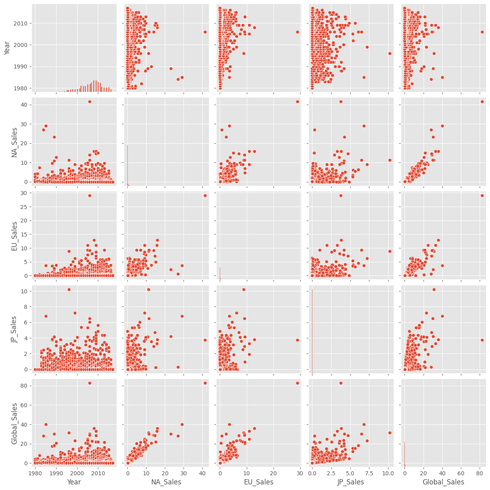

## Добавляем необходимые библиотеки


```python
import numpy as np
import pandas as pd
import seaborn as sns
import matplotlib.pyplot as plt
import os
plt.style.use('ggplot')
```

## Чтение датасета


```python
videogames = pd.read_csv("vgsales.csv")
videogames
```


<div>
<table border="1" class="dataframe">
  <thead>
    <tr style="text-align: right;">
      <th></th>
      <th>Name</th>
      <th>Platform</th>
      <th>Year</th>
      <th>Genre</th>
      <th>Publisher</th>
      <th>NA_Sales</th>
      <th>EU_Sales</th>
      <th>JP_Sales</th>
      <th>Other_Sales</th>
      <th>Global_Sales</th>
    </tr>
  </thead>
  <tbody>
    <tr>
      <th>0</th>
      <td>Kaboom!</td>
      <td>2600</td>
      <td>1980.0</td>
      <td>Misc</td>
      <td>Activision</td>
      <td>1.07</td>
      <td>0.07</td>
      <td>0.0</td>
      <td>0.01</td>
      <td>1.15</td>
    </tr>
    <tr>
      <th>1</th>
      <td>Boxing</td>
      <td>2600</td>
      <td>1980.0</td>
      <td>Fighting</td>
      <td>Activision</td>
      <td>0.72</td>
      <td>0.04</td>
      <td>0.0</td>
      <td>0.01</td>
      <td>0.77</td>
    </tr>
    <tr>
      <th>2</th>
      <td>Ice Hockey</td>
      <td>2600</td>
      <td>1980.0</td>
      <td>Sports</td>
      <td>Activision</td>
      <td>0.46</td>
      <td>0.03</td>
      <td>0.0</td>
      <td>0.01</td>
      <td>0.49</td>
    </tr>
    <tr>
      <th>3</th>
      <td>Freeway</td>
      <td>2600</td>
      <td>1980.0</td>
      <td>Action</td>
      <td>Activision</td>
      <td>0.32</td>
      <td>0.02</td>
      <td>0.0</td>
      <td>0.00</td>
      <td>0.34</td>
    </tr>
    <tr>
      <th>4</th>
      <td>Bridge</td>
      <td>2600</td>
      <td>1980.0</td>
      <td>Misc</td>
      <td>Activision</td>
      <td>0.25</td>
      <td>0.02</td>
      <td>0.0</td>
      <td>0.00</td>
      <td>0.27</td>
    </tr>
    <tr>
      <th>...</th>
      <td>...</td>
      <td>...</td>
      <td>...</td>
      <td>...</td>
      <td>...</td>
      <td>...</td>
      <td>...</td>
      <td>...</td>
      <td>...</td>
      <td>...</td>
    </tr>
    <tr>
      <th>16534</th>
      <td>LEGO Harry Potter: Years 5-7</td>
      <td>PC</td>
      <td>NaN</td>
      <td>Action</td>
      <td>Warner Bros. Interactive Entertainment</td>
      <td>0.05</td>
      <td>0.14</td>
      <td>0.0</td>
      <td>0.03</td>
      <td>0.22</td>
    </tr>
    <tr>
      <th>16535</th>
      <td>Happy Feet Two</td>
      <td>DS</td>
      <td>NaN</td>
      <td>Action</td>
      <td>Warner Bros. Interactive Entertainment</td>
      <td>0.09</td>
      <td>0.02</td>
      <td>0.0</td>
      <td>0.01</td>
      <td>0.12</td>
    </tr>
    <tr>
      <th>16536</th>
      <td>Happy Feet Two</td>
      <td>PS3</td>
      <td>NaN</td>
      <td>Action</td>
      <td>Warner Bros. Interactive Entertainment</td>
      <td>0.09</td>
      <td>0.01</td>
      <td>0.0</td>
      <td>0.01</td>
      <td>0.10</td>
    </tr>
    <tr>
      <th>16537</th>
      <td>Happy Feet Two</td>
      <td>X360</td>
      <td>NaN</td>
      <td>Action</td>
      <td>Warner Bros. Interactive Entertainment</td>
      <td>0.08</td>
      <td>0.01</td>
      <td>0.0</td>
      <td>0.01</td>
      <td>0.10</td>
    </tr>
    <tr>
      <th>16538</th>
      <td>Happy Feet Two</td>
      <td>Wii</td>
      <td>NaN</td>
      <td>Action</td>
      <td>Warner Bros. Interactive Entertainment</td>
      <td>0.07</td>
      <td>0.01</td>
      <td>0.0</td>
      <td>0.01</td>
      <td>0.09</td>
    </tr>
  </tbody>
</table>
<p>16539 rows × 10 columns</p>
</div>


## Общая информация о данных


```python
videogames.shape
```


    (16539, 10)


```python
videogames.info()
```

    <class 'pandas.core.frame.DataFrame'>
    RangeIndex: 16539 entries, 0 to 16538
    Data columns (total 10 columns):
     #   Column        Non-Null Count  Dtype  
    ---  ------        --------------  -----  
     0   Name          16539 non-null  object 
     1   Platform      16539 non-null  object 
     2   Year          16290 non-null  float64
     3   Genre         16539 non-null  object 
     4   Publisher     16539 non-null  object 
     5   NA_Sales      16539 non-null  float64
     6   EU_Sales      16539 non-null  float64
     7   JP_Sales      16539 non-null  float64
     8   Other_Sales   16539 non-null  float64
     9   Global_Sales  16539 non-null  float64
    dtypes: float64(6), object(4)
    memory usage: 1.3+ MB
    


```python
videogames.describe(include='all').T
```


<div>
<table border="1" class="dataframe">
  <thead>
    <tr style="text-align: right;">
      <th></th>
      <th>count</th>
      <th>unique</th>
      <th>top</th>
      <th>freq</th>
      <th>mean</th>
      <th>std</th>
      <th>min</th>
      <th>25%</th>
      <th>50%</th>
      <th>75%</th>
      <th>max</th>
    </tr>
  </thead>
  <tbody>
    <tr>
      <th>Name</th>
      <td>16539</td>
      <td>11441</td>
      <td>Need for Speed: Most Wanted</td>
      <td>12</td>
      <td>NaN</td>
      <td>NaN</td>
      <td>NaN</td>
      <td>NaN</td>
      <td>NaN</td>
      <td>NaN</td>
      <td>NaN</td>
    </tr>
    <tr>
      <th>Platform</th>
      <td>16539</td>
      <td>31</td>
      <td>PS2</td>
      <td>2159</td>
      <td>NaN</td>
      <td>NaN</td>
      <td>NaN</td>
      <td>NaN</td>
      <td>NaN</td>
      <td>NaN</td>
      <td>NaN</td>
    </tr>
    <tr>
      <th>Year</th>
      <td>16290.0</td>
      <td>NaN</td>
      <td>NaN</td>
      <td>NaN</td>
      <td>2006.404727</td>
      <td>5.831618</td>
      <td>1980.0</td>
      <td>2003.0</td>
      <td>2007.0</td>
      <td>2010.0</td>
      <td>2017.0</td>
    </tr>
    <tr>
      <th>Genre</th>
      <td>16539</td>
      <td>12</td>
      <td>Action</td>
      <td>3309</td>
      <td>NaN</td>
      <td>NaN</td>
      <td>NaN</td>
      <td>NaN</td>
      <td>NaN</td>
      <td>NaN</td>
      <td>NaN</td>
    </tr>
    <tr>
      <th>Publisher</th>
      <td>16539</td>
      <td>578</td>
      <td>Electronic Arts</td>
      <td>1351</td>
      <td>NaN</td>
      <td>NaN</td>
      <td>NaN</td>
      <td>NaN</td>
      <td>NaN</td>
      <td>NaN</td>
      <td>NaN</td>
    </tr>
    <tr>
      <th>NA_Sales</th>
      <td>16539.0</td>
      <td>NaN</td>
      <td>NaN</td>
      <td>NaN</td>
      <td>0.265079</td>
      <td>0.817953</td>
      <td>0.0</td>
      <td>0.0</td>
      <td>0.08</td>
      <td>0.24</td>
      <td>41.49</td>
    </tr>
    <tr>
      <th>EU_Sales</th>
      <td>16539.0</td>
      <td>NaN</td>
      <td>NaN</td>
      <td>NaN</td>
      <td>0.146892</td>
      <td>0.506143</td>
      <td>0.0</td>
      <td>0.0</td>
      <td>0.02</td>
      <td>0.11</td>
      <td>29.02</td>
    </tr>
    <tr>
      <th>JP_Sales</th>
      <td>16539.0</td>
      <td>NaN</td>
      <td>NaN</td>
      <td>NaN</td>
      <td>0.078003</td>
      <td>0.309809</td>
      <td>0.0</td>
      <td>0.0</td>
      <td>0.0</td>
      <td>0.04</td>
      <td>10.22</td>
    </tr>
    <tr>
      <th>Other_Sales</th>
      <td>16539.0</td>
      <td>NaN</td>
      <td>NaN</td>
      <td>NaN</td>
      <td>0.048193</td>
      <td>0.188884</td>
      <td>0.0</td>
      <td>0.0</td>
      <td>0.01</td>
      <td>0.04</td>
      <td>10.57</td>
    </tr>
    <tr>
      <th>Global_Sales</th>
      <td>16539.0</td>
      <td>NaN</td>
      <td>NaN</td>
      <td>NaN</td>
      <td>0.538441</td>
      <td>1.55747</td>
      <td>0.01</td>
      <td>0.06</td>
      <td>0.17</td>
      <td>0.48</td>
      <td>82.74</td>
    </tr>
  </tbody>
</table>
</div>


```python
videogames['Global_Sales'].describe()
```


    count    16539.000000
    mean         0.538441
    std          1.557470
    min          0.010000
    25%          0.060000
    50%          0.170000
    75%          0.480000
    max         82.740000
    Name: Global_Sales, dtype: float64


## Анализ количественной информации


```python
videogames['Global_Sales'].plot(kind='box')
```


    <AxesSubplot: >


    

    


```python
IQR = np.quantile(videogames['Global_Sales'],0.75) - np.quantile(videogames['Global_Sales'],0.25)
```


```python
IQR
```


    0.42


```python
np.quantile(videogames['Global_Sales'], 0.5) == videogames['Global_Sales'].median(), np.quantile(videogames['Global_Sales'], 0.5)
```


    (True, 0.17)


```python
videogames['Global_Sales'].min(),videogames['Global_Sales'].max()
```


    (0.01, 82.74)


```python

videogames['Genre'].hist()
```


    <AxesSubplot: >


    

    


```python
videogames['Global_Sales'].plot()
```


    <AxesSubplot: >


    

    


```python
sns.violinplot(y = 'Year', data= videogames )
```


    <AxesSubplot: ylabel='Year'>


    

    


```python
videogames['Year'].value_counts()
```


    2009.0    1431
    2008.0    1428
    2010.0    1257
    2007.0    1201
    2011.0    1136
    2006.0    1008
    2005.0     936
    2002.0     829
    2003.0     775
    2004.0     744
    2012.0     655
    2015.0     614
    2014.0     580
    2013.0     546
    2001.0     482
    1998.0     379
    2000.0     349
    2016.0     342
    1999.0     338
    1997.0     289
    1996.0     263
    1995.0     219
    1994.0     121
    1993.0      60
    1981.0      46
    1992.0      43
    1991.0      41
    1982.0      36
    1986.0      21
    1989.0      17
    1983.0      17
    1987.0      16
    1990.0      16
    1988.0      15
    1985.0      14
    1984.0      14
    1980.0       9
    2017.0       3
    Name: Year, dtype: int64


## Анализ категориальной информации


```python
sns.countplot(x = 'Genre', data = videogames )
```


    <AxesSubplot: xlabel='Genre', ylabel='count'>


    

    


```python
videogames['Y'] = videogames['Global_Sales']  > 0.5
```


```python
sns.countplot(x = 'Year',hue = 'Y', data = videogames )
```


    <AxesSubplot: xlabel='Year', ylabel='count'>


    

    


```python
videogames
```


<div>
<table border="1" class="dataframe">
  <thead>
    <tr style="text-align: right;">
      <th></th>
      <th>Name</th>
      <th>Platform</th>
      <th>Year</th>
      <th>Genre</th>
      <th>Publisher</th>
      <th>NA_Sales</th>
      <th>EU_Sales</th>
      <th>JP_Sales</th>
      <th>Other_Sales</th>
      <th>Global_Sales</th>
      <th>Y</th>
    </tr>
  </thead>
  <tbody>
    <tr>
      <th>0</th>
      <td>Kaboom!</td>
      <td>2600</td>
      <td>1980.0</td>
      <td>Misc</td>
      <td>Activision</td>
      <td>1.07</td>
      <td>0.07</td>
      <td>0.0</td>
      <td>0.01</td>
      <td>1.15</td>
      <td>True</td>
    </tr>
    <tr>
      <th>1</th>
      <td>Boxing</td>
      <td>2600</td>
      <td>1980.0</td>
      <td>Fighting</td>
      <td>Activision</td>
      <td>0.72</td>
      <td>0.04</td>
      <td>0.0</td>
      <td>0.01</td>
      <td>0.77</td>
      <td>True</td>
    </tr>
    <tr>
      <th>2</th>
      <td>Ice Hockey</td>
      <td>2600</td>
      <td>1980.0</td>
      <td>Sports</td>
      <td>Activision</td>
      <td>0.46</td>
      <td>0.03</td>
      <td>0.0</td>
      <td>0.01</td>
      <td>0.49</td>
      <td>False</td>
    </tr>
    <tr>
      <th>3</th>
      <td>Freeway</td>
      <td>2600</td>
      <td>1980.0</td>
      <td>Action</td>
      <td>Activision</td>
      <td>0.32</td>
      <td>0.02</td>
      <td>0.0</td>
      <td>0.00</td>
      <td>0.34</td>
      <td>False</td>
    </tr>
    <tr>
      <th>4</th>
      <td>Bridge</td>
      <td>2600</td>
      <td>1980.0</td>
      <td>Misc</td>
      <td>Activision</td>
      <td>0.25</td>
      <td>0.02</td>
      <td>0.0</td>
      <td>0.00</td>
      <td>0.27</td>
      <td>False</td>
    </tr>
    <tr>
      <th>...</th>
      <td>...</td>
      <td>...</td>
      <td>...</td>
      <td>...</td>
      <td>...</td>
      <td>...</td>
      <td>...</td>
      <td>...</td>
      <td>...</td>
      <td>...</td>
      <td>...</td>
    </tr>
    <tr>
      <th>16534</th>
      <td>LEGO Harry Potter: Years 5-7</td>
      <td>PC</td>
      <td>NaN</td>
      <td>Action</td>
      <td>Warner Bros. Interactive Entertainment</td>
      <td>0.05</td>
      <td>0.14</td>
      <td>0.0</td>
      <td>0.03</td>
      <td>0.22</td>
      <td>False</td>
    </tr>
    <tr>
      <th>16535</th>
      <td>Happy Feet Two</td>
      <td>DS</td>
      <td>NaN</td>
      <td>Action</td>
      <td>Warner Bros. Interactive Entertainment</td>
      <td>0.09</td>
      <td>0.02</td>
      <td>0.0</td>
      <td>0.01</td>
      <td>0.12</td>
      <td>False</td>
    </tr>
    <tr>
      <th>16536</th>
      <td>Happy Feet Two</td>
      <td>PS3</td>
      <td>NaN</td>
      <td>Action</td>
      <td>Warner Bros. Interactive Entertainment</td>
      <td>0.09</td>
      <td>0.01</td>
      <td>0.0</td>
      <td>0.01</td>
      <td>0.10</td>
      <td>False</td>
    </tr>
    <tr>
      <th>16537</th>
      <td>Happy Feet Two</td>
      <td>X360</td>
      <td>NaN</td>
      <td>Action</td>
      <td>Warner Bros. Interactive Entertainment</td>
      <td>0.08</td>
      <td>0.01</td>
      <td>0.0</td>
      <td>0.01</td>
      <td>0.10</td>
      <td>False</td>
    </tr>
    <tr>
      <th>16538</th>
      <td>Happy Feet Two</td>
      <td>Wii</td>
      <td>NaN</td>
      <td>Action</td>
      <td>Warner Bros. Interactive Entertainment</td>
      <td>0.07</td>
      <td>0.01</td>
      <td>0.0</td>
      <td>0.01</td>
      <td>0.09</td>
      <td>False</td>
    </tr>
  </tbody>
</table>
<p>16539 rows × 11 columns</p>
</div>


## Сравнение распределений признаков для разных классов


```python
sns.boxplot(x ='Y', y = 'Year', data = videogames)
```


    <AxesSubplot: xlabel='Y', ylabel='Year'>


    

    


## Анализ зависимости двух непрерывных переменных


```python
sns.pairplot(videogames[['Year',
       'NA_Sales',
       'EU_Sales', 'JP_Sales', 'Global_Sales']])
```


    <seaborn.axisgrid.PairGrid at 0x24334499660>


    

    


```python
corr = videogames[['Year',
       'NA_Sales',
       'EU_Sales', 'JP_Sales', 'Global_Sales']].corr()
```


```python
corr
```


<div>
<table border="1" class="dataframe">
  <thead>
    <tr style="text-align: right;">
      <th></th>
      <th>Year</th>
      <th>NA_Sales</th>
      <th>EU_Sales</th>
      <th>JP_Sales</th>
      <th>Global_Sales</th>
    </tr>
  </thead>
  <tbody>
    <tr>
      <th>Year</th>
      <td>1.000000</td>
      <td>-0.091301</td>
      <td>0.006151</td>
      <td>-0.169379</td>
      <td>-0.074637</td>
    </tr>
    <tr>
      <th>NA_Sales</th>
      <td>-0.091301</td>
      <td>1.000000</td>
      <td>0.767674</td>
      <td>0.449865</td>
      <td>0.941037</td>
    </tr>
    <tr>
      <th>EU_Sales</th>
      <td>0.006151</td>
      <td>0.767674</td>
      <td>1.000000</td>
      <td>0.435655</td>
      <td>0.902818</td>
    </tr>
    <tr>
      <th>JP_Sales</th>
      <td>-0.169379</td>
      <td>0.449865</td>
      <td>0.435655</td>
      <td>1.000000</td>
      <td>0.611892</td>
    </tr>
    <tr>
      <th>Global_Sales</th>
      <td>-0.074637</td>
      <td>0.941037</td>
      <td>0.902818</td>
      <td>0.611892</td>
      <td>1.000000</td>
    </tr>
  </tbody>
</table>
</div>


```python
corr['Year']
```


    Year            1.000000
    NA_Sales       -0.091301
    EU_Sales        0.006151
    JP_Sales       -0.169379
    Global_Sales   -0.074637
    Name: Year, dtype: float64


```python
mask = np.triu(np.ones_like(corr,dtype=bool))
cmap = sns.diverging_palette(230,20, as_cmap=True)
sns.heatmap(corr,annot=True,mask=mask, cmap=cmap)
```


    <AxesSubplot: >


    

    


```python
sns.boxplot(x= 'Global_Sales', y='Genre',hue='Y',data = videogames)
```


    <AxesSubplot: xlabel='Global_Sales', ylabel='Genre'>


    

    


```python

```
